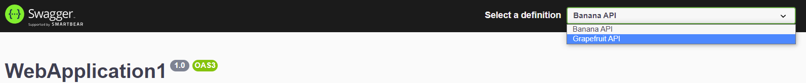

# Swagger Aggregator Example

## How do I use a setup like this?
1. Enable CORS (be sure to add it before `UseSwagger()` or `UseSwaggerUI()`
```c#
app.UseCors(x =>
{
    //add CORS configuration here, before app.UseSwagger() or app.useSwaggerUI()
});

if (app.Environment.IsDevelopment() || app.Environment.IsStaging())
{
    app.UseSwagger();
    app.UseSwaggerUI(x =>
    {
        x.SwaggerEndpoint("https://localhost:7152/swagger/v1/swagger.json", "Banana API");
        x.SwaggerEndpoint("https://localhost:7084/swagger/v1/swagger.json", "Grapefruit API");
    });
}
```
2. Enable staging environment to serve Swagger documents while deployed (since you probably don't want to deploy in debug mode ;) )
3. Add a swagger endpoint for every microservice you want to show information for. The second string param will show as the selectable option in the dropbox:
```c#
app.UseSwaggerUI(x =>
{
    x.SwaggerEndpoint("https://localhost:7152/swagger/v1/swagger.json", "Banana API");
    x.SwaggerEndpoint("https://localhost:7084/swagger/v1/swagger.json", "Grapefruit API");
});
```

4. Remember to build and deploy your app as Staging to make use of the changes from step 2

## Resources
- [How to enable CORS in Dotnet]("https://docs.microsoft.com/en-us/aspnet/core/security/cors?view=aspnetcore-6.0)

## TODO
- Multiple versions in a single Web API
  - https://stackoverflow.com/questions/60847380/create-2-different-swagger-ui-for-that-which-can-run-with-two-different-version
  - https://referbruv.com/blog/posts/integrating-aspnet-core-api-versions-with-swagger-ui

